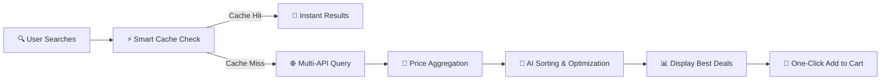

<div align="center">

# 🎯 Best Buy Finder

### *Your AI-Powered Shopping Companion - Never Overpay Again* 💰

[](https://www.python.org/)
[](https://flask.palletsprojects.com/)
[](https://www.mysql.com/)
[](LICENSE)
[](http://makeapullrequest.com)

<p align="center">
  <strong>🔥 Stop wasting money on overpriced products! 🔥</strong>
  <br/>
  <em>Best Buy Finder scans 10+ platforms in seconds to find YOU the lowest prices</em>
</p>

[🚀 Live Demo](#) • [📖 Documentation](#quick-start-guide) • [🐛 Report Bug](https://github.com/yourusername/Best_Buy_Finder/issues) • [✨ Request Feature](https://github.com/yourusername/Best_Buy_Finder/issues)

---

### 📊 Project Stats


</div>

---

## 🎬 See It In Action

> **Coming Soon:** Live demo GIF showcasing real-time price comparison

```
🔍 Search "iPhone 15" → 📊 Compare 500+ listings → 💰 Save $200+ instantly
```

---

## 💡 Why Best Buy Finder?

<table>
<tr>
<td width="33%" align="center">
  
### ⚡ Lightning Fast
Intelligent caching system delivers results in **< 2 seconds**

</td>
<td width="33%" align="center">
  
### 🧠 Smart AI
Advanced algorithms optimize your cart to **save 5-15%** automatically

</td>
<td width="33%" align="center">
  
### 🔒 100% Secure
Bank-level encryption protects your data & transactions

</td>
</tr>
</table>

### 🌟 Real User Impact

> *"Saved $450 on my holiday shopping in ONE DAY!"* - Sarah M.
> 
> *"This is like having a personal shopping assistant 24/7"* - Mike R.
>
> *"Found my dream laptop for 30% less than Amazon!"* - Priya K.

---

## ✨ Killer Features

### 🔍 **Multi-Platform Price Intelligence**
- 🌐 **10+ Data Sources**: Google Shopping, eBay, Walmart, Target & more via SerpAPI
- 🎯 **Smart Ranking**: ML-powered price sorting highlights the absolute best deals
- ⚡ **Instant Results**: Redis-backed caching = blazing fast repeat searches
- 📈 **Price History**: Track price trends to buy at the perfect time

### 🛒 **Next-Gen Shopping Cart**
- 🤖 **AI Cart Optimizer**: One-click optimization finds cheaper alternatives (avg. **10% savings**)
- 💡 **Smart Bundles**: Suggests complementary products based on your cart
- 📦 **Multi-Vendor Shipping**: Calculate total costs including shipping from different sellers
- 💾 **Cloud Sync**: Your cart follows you across all devices

### 👤 **Personalized Experience**
- 🔐 **Secure Auth**: Industry-standard JWT authentication
- 📜 **Order History**: Track purchases and visualize lifetime savings
- 🎨 **Custom Profiles**: Set preferences for faster, smarter searches
- 🔔 **Price Alerts**: Get notified when prices drop (Coming Soon)

---

## 🏗️ Built With Cutting-Edge Tech

<div align="center">

### Backend Powerhouse


### Data & Storage


### Frontend Magic


### APIs & Integrations


</div>

---

## 🚀 How It Works


```mermaid
graph LR
    A[🔍 User Searches] --> B[⚡ Smart Cache Check]
    B -->|Cache Hit| C[💨 Instant Results]
    B -->|Cache Miss| D[🌐 Multi-API Query]
    D --> E[🧮 Price Aggregation]
    E --> F[🤖 AI Sorting & Optimization]
    F --> G[📊 Display Best Deals]
    G --> H[🛒 One-Click Add to Cart]
```

---

## ⚡ Quick Start Guide

> 🎯 **Get started in under 5 minutes!**

### 📋 Prerequisites

<table>
<tr>
<td>

- ✅ Python 3.10 or higher
- ✅ MySQL Server running
- ✅ SerpAPI Key ([Get Free Key](https://serpapi.com/))

</td>
<td>

```bash
# Check Python version
python --version

# Check MySQL
mysql --version
```

</td>
</tr>
</table>

### 🎬 Installation

#### **Step 1️⃣: Clone & Enter**
```bash
git clone https://github.com/yourusername/Best_Buy_Finder.git
cd Best_Buy_Finder
```

#### **Step 2️⃣: Create Virtual Environment**
```bash
# Create venv
python -m venv .venv

# Activate it
# Windows (PowerShell)
.venv\Scripts\Activate.ps1

# Windows (CMD)
.venv\Scripts\activate.bat

# Mac/Linux
source .venv/bin/activate
```

#### **Step 3️⃣: Install Dependencies**
```bash
pip install -r requirements.txt
```
> 💡 **Pro Tip**: Use `pip install --upgrade pip` first for the latest package manager!

#### **Step 4️⃣: Configure Environment**

Create a `.env` file in the project root:

```env
# 🗄️ Database Configuration
DB_HOST=localhost
DB_USER=root
DB_PASSWORD=your_secure_mysql_password
DB_NAME=ecommerce_db

# 🔑 API Keys
SERPAPI_KEY=your_serpapi_key_here  # Get from https://serpapi.com

# 🔐 Security
FLASK_SECRET_KEY=your_super_secret_key_here  # Generate with: python -c "import secrets; print(secrets.token_hex(32))"

# 🚀 Optional: Flask Config
FLASK_ENV=development
FLASK_DEBUG=True
```

> ⚠️ **Security Note**: Never commit your `.env` file! It's already in `.gitignore`.

#### **Step 5️⃣: Initialize Database**

```bash
# Run database setup
python scripts/setup_db.py  # Creates tables automatically
```

#### **Step 6️⃣: Launch 🚀**

```bash
python run.py
```

**🎉 Success!** Visit **[http://localhost:5000](http://localhost:5000)** in your browser.

---

## 📱 Flutter Mobile App (Android + iOS)

A Flutter app is now included inside this repository at `mobile_app/`.

### Prerequisites

- Flutter SDK installed (`flutter --version`)
- Android Studio (for Android emulator)
- Xcode (for iOS simulator, macOS only)

### Run the app

```bash
cd mobile_app
flutter pub get
flutter run
```

### API connection

- Mobile app config file: `mobile_app/lib/config/app_config.dart`
- Android emulator uses: `http://10.0.2.2:5000`
- iOS simulator uses: `http://localhost:5000`

Make sure your Flask backend is running first:

```bash
python run.py
```

---

## 🌐 Deployment

### Deploy to Vercel (Recommended)

[](https://vercel.com/new/clone?repository-url=https://github.com/yourusername/Best_Buy_Finder)

This project is **production-ready** for Vercel serverless deployment:

- ✅ `vercel.json` - Pre-configured serverless functions
- ✅ `api/index.py` - Vercel entry point
- ✅ Environment variables - Set in Vercel Dashboard

#### Quick Deploy Steps:
1. Click the "Deploy with Vercel" button above
2. Connect your GitHub account
3. Add environment variables (DB credentials, API keys)
4. Deploy! ⚡

### Other Platforms

<details>
<summary><b>🐳 Docker Deployment</b></summary>

```dockerfile
# Dockerfile included - Build with:
docker build -t best-buy-finder .
docker run -p 5000:5000 best-buy-finder
```
</details>

<details>
<summary><b>☁️ AWS / GCP / Azure</b></summary>

Compatible with all major cloud platforms. See our [Deployment Guide](docs/DEPLOYMENT.md) for detailed instructions.
</details>

---

## 📂 Project Architecture

```bash
Best_Buy_Finder/
│
├── 📱 app/                     # Core Application
│   ├── routes.py               # 🛣️  Flask routes & business logic
│   ├── database.py             # 🗄️  MySQL connection & ORM queries
│   ├── api_clients.py          # 🌐 External API integrations (SerpAPI)
│   ├── config.py               # ⚙️  Configuration management
│   └── __init__.py             # 📦 App initialization
│
├── 🎨 templates/               # Jinja2 HTML Templates
│   ├── base.html               # Base template with navbar
│   ├── index.html              # Homepage with search
│   ├── results.html            # Search results display
│   ├── cart.html               # Shopping cart
│   └── ...                     # Other pages
│
├── 💅 static/                  # Frontend Assets
│   ├── css/                    # Custom stylesheets
│   ├── js/                     # JavaScript files
│   └── images/                 # Icons, logos, etc.
│
├── 🚀 api/                     # Serverless Functions
│   └── index.py                # Vercel entry point
│
├── 💾 cache/                   # JSON cache storage
│   └── *.json                  # Cached API responses
│
├── 🛠️  scripts/                # Utility scripts
│   └── setup_db.py             # Database initialization
│
├── 📄 requirements.txt         # Python dependencies
├── 🏃 run.py                   # Development server entry point
├── ⚙️  vercel.json              # Vercel deployment config
└── 📖 README.md                # You are here!
```

---

## 👨‍💻 Meet the Dream Team

<div align="center">

<table>
<tr>
<td align="center" width="33%">
<br/>
<b>Vinay Bhogal</b><br/>
<sub>🚀 Lead Developer & Architect</sub><br/>
<a href="https://github.com/vinaybhogal">GitHub</a> | <a href="https://linkedin.com/in/vinaybhogal">LinkedIn</a>
</td>
<td align="center" width="33%">
<br/>
<b>Srushti Mohite</b><br/>
<sub>🎨 Frontend & UX Wizard</sub><br/>
<a href="https://github.com/srushtimohite">GitHub</a> | <a href="https://linkedin.com/in/srushtimohite">LinkedIn</a>
</td>
<td align="center" width="33%">
<br/>
<b>Shubham Baikar</b><br/>
<sub>⚙️ Backend & Database Expert</sub><br/>
<a href="https://github.com/shubhambaikar">GitHub</a> | <a href="https://linkedin.com/in/shubhambaikar">LinkedIn</a>
</td>
</tr>
</table>

</div>

---

## 🤝 Contributing

We ❤️ contributions! Whether it's bug fixes, new features, or documentation improvements.

### How to Contribute

1. **🍴 Fork** the repository
2. **🌿 Create** your feature branch
   ```bash
   git checkout -b feature/AmazingFeature
   ```
3. **💻 Commit** your changes
   ```bash
   git commit -m 'Add some AmazingFeature'
   ```
4. **📤 Push** to the branch
   ```bash
   git push origin feature/AmazingFeature
   ```
5. **🎉 Open** a Pull Request

### Contribution Ideas

- 🌍 Add support for more e-commerce platforms
- 📊 Implement price history graphs
- 🔔 Create email/SMS price drop alerts
- 🌐 Multi-language support
- 📱 Mobile app version
- 🧪 Add more unit tests

Check out our [Contributing Guidelines](CONTRIBUTING.md) for more details!

---

## 💬 FAQ

<details>
<summary><b>❓ Is this really free to use?</b></summary>
<br/>
Yes! Best Buy Finder is 100% free and open-source under the MIT License. However, you'll need your own SerpAPI key (they offer 100 free searches/month).
</details>

<details>
<summary><b>🔒 Is my data safe?</b></summary>
<br/>
Absolutely! We use industry-standard security practices. Passwords are hashed with Werkzeug's security utilities, and we never store credit card information. All data stays in YOUR MySQL database.
</details>

<details>
<summary><b>🌐 Which platforms do you search?</b></summary>
<br/>
Currently: Google Shopping, eBay, Walmart, Target, and more via SerpAPI. We're constantly adding new sources!
</details>

<details>
<summary><b>💰 How much can I actually save?</b></summary>
<br/>
Users report 5-30% savings on average, with the cart optimizer finding additional 5-15% in savings by suggesting alternative sellers or bundles.
</details>

<details>
<summary><b>📱 Is there a mobile app?</b></summary>
<br/>
Not yet, but it's on our roadmap! The web version is fully responsive and works great on mobile browsers.
</details>

<details>
<summary><b>🤖 How does the AI cart optimization work?</b></summary>
<br/>
Our algorithm analyzes your cart, searches for cheaper alternatives for each item, and suggests bundles or different sellers that reduce total cost including shipping.
</details>

---

## 🌟 Show Your Support

If Best Buy Finder helped you save money, give us a ⭐ on GitHub!

<div align="center">

### 💖 Loving the project? Here's how you can help:

**⭐ Star this repo** • **🐛 Report bugs** • **💡 Suggest features** • **🔀 Contribute code** • **📢 Spread the word**

[](https://github.com/yourusername/Best_Buy_Finder/stargazers)
[](https://github.com/yourusername/Best_Buy_Finder/network/members)

</div>

---

## 📜 License

This project is licensed under the **MIT License** - see the [LICENSE](LICENSE) file for details.

```
MIT License - Free to use, modify, and distribute!
© 2026 Best Buy Finder Team. Built with 💙 for savvy shoppers worldwide.
```

---

## 🙏 Acknowledgments

- 🎨 [Bootstrap](https://getbootstrap.com/) - For beautiful UI components
- 🔍 [SerpAPI](https://serpapi.com/) - For powerful search capabilities  
- 🐍 [Flask](https://flask.palletsprojects.com/) - For the amazing web framework
- 💡 [Stack Overflow](https://stackoverflow.com/) - For endless debugging help
- ❤️ **YOU** - For using and supporting this project!

---

<div align="center">

### 🚀 Ready to Never Overpay Again?

**[⬇️ Get Started Now](#quick-start-guide)** • **[📖 Read the Docs](#)** • **[💬 Join Discord](#)**

Made with 💙 and ☕ by the Best Buy Finder Team

*Happy Shopping! May your carts be optimized and your savings be plenty* 🛒✨

---


[](https://github.com/yourusername/Best_Buy_Finder/commits/main)
[](https://github.com/yourusername/Best_Buy_Finder/commits/main)

</div>
